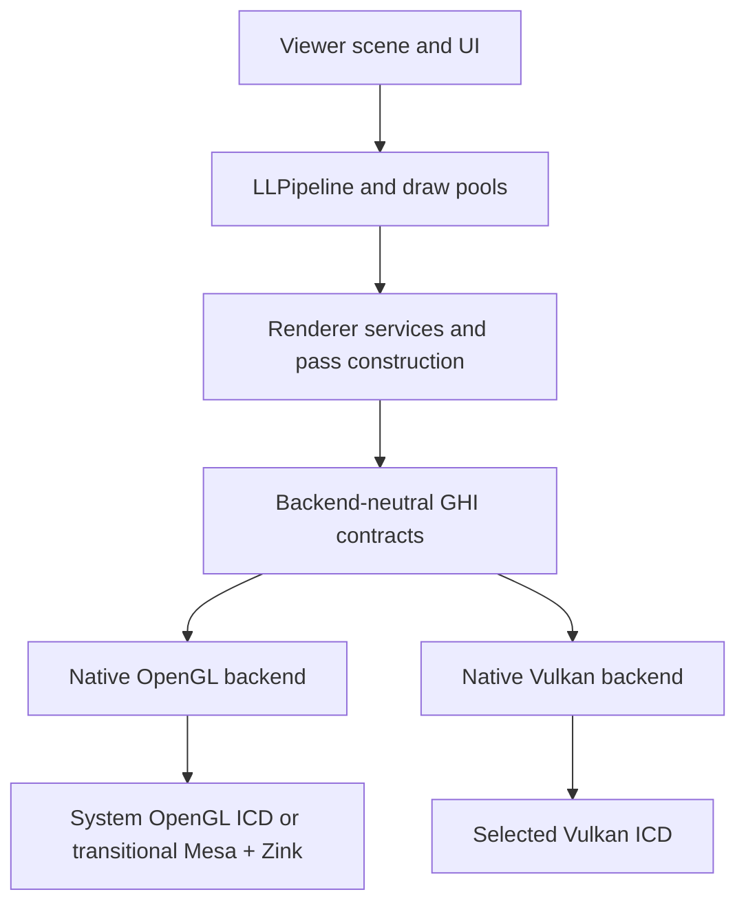

# OpenGL and Vulkan-native peer-backend architecture

## Decision

Firestorm will expose one renderer-facing Graphics Hardware Interface (GHI)
implemented by two first-class native backends:

1. OpenGL
2. Vulkan

The selected backend owns the process's graphics device, resources, command
submission, and presentation for the complete viewer session. Selection occurs
at startup and requires a restart to change. The two backends are peers; Vulkan
does not wrap, translate, replace, or retire OpenGL.

Mesa + Zink is an OpenGL implementation selected beneath the OpenGL backend.
It remains isolated in the finite-lifetime `perf/zink-80` work. It must not be
used as the native Vulkan implementation, the GHI contract, or the Vulkan
correctness oracle. The accepted baseline tag records Mesa + Zink as a useful
visual reference and native OpenGL as a performance reference.

### Production-rendering invariant

Throughout R0-R8 development and all intermediate releases, production world
and UI rendering remains on the OpenGL backend. Native Vulkan is available only
through explicit developer gates until the entire parity ledger and production-
eligibility gate pass. Completing an individual Vulkan slice, including window
presentation, does not make that slice eligible to render a production session.

Mesa + Zink remains the transitional OpenGL correctness path for supported
systems during that period. Its retirement is a separate, post-parity release
decision and is feasible only after native Vulkan has demonstrated complete
world/UI parity, stability, hardware coverage, recovery behavior, and accepted
performance. Retiring Mesa + Zink does not retire native OpenGL, which remains
a supported peer and rollback path.

## Goals

- Preserve OpenGL as a supported, selectable production backend.
- Add a production-grade Vulkan backend on Windows and Linux.
- Present the same rendering capabilities through both native backends.
- Match the accepted Mesa-correct output for documented AMD OpenGL rendering
  divergences while achieving native accelerated performance.
- Prevent graphics-API types and calls from leaking above backend directories.
- Add capabilities incrementally without destabilizing production OpenGL.
- Make resource lifetime, synchronization, and pass dependencies explicit.
- Reuse the R00-R14 reference evidence and parity ledger for acceptance.

## Non-goals

- Replacing or deprecating OpenGL.
- Converting individual `gl*` calls into identically shaped virtual calls.
- Implementing Vulkan by routing OpenGL through Mesa + Zink.
- Running OpenGL and Vulkan concurrently in one viewer process.
- Supporting live backend switching without restarting the viewer.
- Making macOS depend on Vulkan. Its OpenGL 4.1 path remains supported.
- Requiring bit-identical floating-point raster output between different APIs
  and drivers. Ordering, classification, resource, and synchronization rules
  must be deterministic; image acceptance uses the established tolerances.

## Requirements and constraints

### Functional

- Startup, window lifecycle, presentation, and clean shutdown.
- Static, dynamic, rigged, and instanced geometry.
- Legacy and PBR materials, terrain, water, atmosphere, lighting, and shadows.
- Legacy alpha, masks, PPLL, and depth peeling with their existing routing
  exclusions.
- Reflection probes, hero probes, mirrors, cube snapshots, and impostors.
- UI, fonts, HUD attachments, picking, snapshots, and framebuffer readback.
- Streaming textures, arrays, cube maps, media, and dynamic texture updates.
- GPU timestamps, occlusion queries, debug labels, and capture tooling.

### Non-functional

- No steady-state whole-device waits.
- Bounded frames in flight and deferred destruction tied to GPU completion.
- Structured initialization failures and deterministic fallback policy.
- Validation-layer-clean Vulkan operation in development builds.
- Per-device pipeline caching and reproducible shader keys.
- No increase in native API coupling outside reviewed backend directories.

### Initial platform assumptions

- The first Vulkan implementation targets Windows and Linux.
- Vulkan 1.3 is the initial native-backend floor. Unsupported systems retain
  OpenGL rather than receiving a reduced or silently translated Vulkan path.
- One graphics queue is sufficient for first production bring-up. Transfer and
  compute queues are adopted only when measurements show a benefit.
- The render thread remains the sole graphics submission owner initially.
  Worker threads may prepare CPU data but do not submit graphics work.

The Vulkan version and queue policy must be revisited after the first hardware
coverage survey; they are not constraints on the OpenGL backend.

## Layering and ownership



The dependency direction is strictly downward. Backend code may depend on GHI
contracts. GHI contracts must not include OpenGL or Vulkan headers. Viewer,
UI, and pipeline code must not depend on backend implementation headers.

Proposed source layout:

```text
indra/llrender/ghi/
  include/                 backend-neutral public contracts
  core/                    validation, handles, descriptors, tracing
  backends/opengl/         the only new OpenGL-native implementation code
  backends/vulkan/         the only Vulkan-native implementation code
```

The API-boundary ratchet must exclude only the two backend implementation
directories. Native calls in `include/` or `core/` are violations.

## The GHI seam

The seam is below render-feature decisions and above native API mechanics.
`LLPipeline` and draw pools continue to decide *what* is rendered and in what
semantic phase. The GHI decides *how* resources, state, commands, barriers,
queues, and presentation are expressed on the selected API.

### Device and lifecycle

- `LLGHIInstance`: backend discovery, diagnostics, and adapter enumeration.
- `LLGHIDevice`: selected adapter, capabilities, queues, resource creation,
  completion timeline, and device-loss state.
- `LLGHISurface`: window surface, swapchain/default framebuffer, resize,
  acquire, present, fullscreen/display changes, and color-space metadata.
- `LLGHIFrameContext`: per-frame allocators, staging space, descriptors, query
  storage, acquire/present synchronization, and completion value.

There is exactly one active `LLGHIDevice`. Backend selection is complete before
render-owned resources are created.

### Resources

Public resources use typed, generational handles rather than native integer
names or pointers:

- buffer
- image and image view
- sampler
- shader package
- graphics/compute pipeline
- query pool

Creation uses immutable descriptors with backend-neutral enums. Resource usage
is explicit: vertex, index, uniform, storage, sampled, color attachment,
depth/stencil attachment, transfer source/destination, and presentation.

Destruction is logical at the call site and physical only after the last GPU
completion value that references the resource. No backend may free an in-flight
resource merely because the viewer dropped its final CPU reference.

### Passes and commands

`LLGHICommandContext` records explicit work:

- begin/end debug scope
- begin/end rendering pass
- declare attachment load/store operations
- bind graphics or compute pipeline
- bind resource groups and dynamic constants
- set viewport, scissor, depth bias, and other permitted dynamic state
- bind vertex/index buffers
- draw, draw indexed, dispatch, copy, clear, resolve, and read back
- write timestamps and begin/end queries

Pass descriptions declare every attachment and sampled/storage dependency.
The Vulkan backend derives layouts and barriers from those declarations. The
OpenGL backend maps them to the existing state cache and the minimum required
memory barriers. Backend-specific synchronization is not visible to draw pools.

Hot draw loops submit batches of draw packets to avoid making a polymorphic
call for every uniform or vertex attribute. Backend dispatch happens at command
context or batch granularity.

### State and pipelines

Pipeline state is immutable and fully described by:

- shader package and permutation key
- vertex layout
- topology
- rasterization and culling
- depth/stencil state
- blend state for every color attachment
- attachment formats and sample count
- specialization constants

This replaces reliance on ambient OpenGL state. The OpenGL backend may cache
and apply state lazily, but the contract presented to renderer code remains
explicit.

### Bindings and shaders

Existing GLSL source and feature permutations remain the semantic source during
bring-up. A shared shader prelude defines stable binding groups:

1. frame/view data
2. pass data
3. material data and sampled images
4. draw/object data
5. storage resources for algorithms such as PPLL

OpenGL compiles the OpenGL variant. Vulkan compiles the Vulkan variant to
SPIR-V and validates reflected bindings against a generated manifest. Raw GL
uniform locations and implicit texture-unit allocation are not part of GHI.

R3 refines this into distinct target profiles: packaged OpenGL 4.4 GLSL for
Windows/Linux, OpenGL 4.1 GLSL for macOS and an explicit compatibility
fallback, and Vulkan-specific GLSL compiled offline to SPIR-V for the Vulkan
peer. Shared algorithm includes are used only where semantics truly match.
Slang is a contingency frontend if Vulkan GLSL proves objectively infeasible;
the runtime SPIR-V, reflection, and pipeline contracts remain frontend-
independent.

A shader/pipeline cache key includes source hashes, ordered defines,
specialization values, vertex layout, attachment formats, device identity,
driver identity, and backend. Pipeline creation must be asynchronous where
possible, with explicit warm-up evidence for cold and steady-state baselines.

The viewer's current clip convention remains canonical during incremental
integration. The Vulkan shader prelude or projection adapter performs the
Vulkan Y/depth conversion in one reviewed location. Reverse-Z behavior must be
covered by focused projection and depth tests before world rendering is added.

## Existing classes during integration

The current classes are not the final seam:

- `LLRender` and global `gGL` model implicit mutable OpenGL state.
- `LLVertexBuffer` stores GL names and GL index types.
- `LLRenderTarget` models FBO binding and exposes attachment names.
- `LLGLSLShader` exposes GL programs, locations, texture units, and queries.
- `LLImageGL` owns OpenGL texture mechanics.

They remain source-compatible adapters while individual rendering slices are
placed behind GHI. Their internals gain GHI handles only when a slice needs
them. New renderer-facing code must use GHI contracts directly and must not add
new GL-shaped methods to these compatibility classes.

Each adopted slice must execute through both the OpenGL and Vulkan GHI
implementations. Code not yet adopted remains on the existing OpenGL path and
keeps the Vulkan backend developer-gated. A production Vulkan selection is not
offered until the complete required ledger is satisfied. Intermediate releases
must continue to route the complete production world/UI frame through OpenGL;
they must not assemble a hybrid production frame from completed Vulkan slices.

## Backend selection and fallback

Keep API selection separate from OpenGL implementation selection:

- `RenderBackend`: `auto`, `opengl`, or `vulkan`
- `OpenGLProvider`: `system` or transitional `mesa-zink`

The UI may present these as a single friendly choice list, but internal state
must not confuse Zink with the Vulkan backend.

- Explicit Vulkan selection: initialization failure is reported clearly and
  does not silently become OpenGL.
- Explicit OpenGL selection: use the chosen OpenGL provider and its existing
  documented provider fallback policy.
- Auto: may attempt Vulkan only after the Vulkan backend is production-eligible
  on that platform. A failure before resource creation may fall back once to
  OpenGL with a structured reason in the log and About information.
- No mid-session API fallback. Device loss terminates rendering cleanly and
  offers a restart path; it does not transfer live resources between APIs.

Before production eligibility, `RenderBackend=vulkan` is accepted only by
developer lifecycle/parity harnesses. Normal viewer sessions remain OpenGL even
in builds that contain the Vulkan backend. Mesa + Zink cannot be removed merely
because native Vulkan can initialize or render a subset of passes.

Graphics settings are keyed by physical GPU identity, not by backend. Switching
OpenGL/Vulkan on the same GPU preserves the profile. A different GPU resets or
selects that GPU's profile, consistent with the existing persistence design.

## Renderer identity, capabilities, and quality policy

Both peer backends publish one backend-neutral renderer snapshot after device
creation and before graphics policy is applied. It has two distinct parts:

- `RendererIdentity`: rendering API and version, backend/provider, physical
  device name and stable identifier, vendor/device IDs, driver name/version,
  and memory totals/budget.
- `RendererCapabilities`: semantic limits and features used by viewer policy,
  such as attachment and texture limits, sample counts, queries, storage image
  atomics, descriptor/binding capacity, and depth clamp.

No viewer policy or user-facing diagnostics may infer Vulkan support from raw
extensions or infer the selected backend from OpenGL renderer strings. Native
API discovery is translated into these structures inside its GHI backend.

`LLFeatureManager` remains the policy owner and feature tables remain the
settings mechanism, but backend masks are selected from semantic capabilities
rather than `gGLManager` fields. Quality level and saved settings belong to the
physical GPU profile; backend-dependent feature availability is recalculated
whenever the rendering API changes. Changing API/provider on the same GPU does
not reset the profile. Changing the physical GPU does.

Help -> About, recommended-settings notifications, logs, viewer stats, and
crash diagnostics consume the same identity snapshot and formatter. OpenGL
retains its API/version reporting, Mesa + Zink remains identified as an OpenGL
provider, and native Vulkan reports its Vulkan API/device/driver information
without presenting itself as Mesa or OpenGL.

## Frame scheduling and synchronization

- Default to two bounded frames in flight, adjustable only for diagnostics.
- Use per-frame command, descriptor, staging, and query arenas.
- Use a monotonically increasing completion timeline for resource retirement.
- Use binary acquire/present semaphores where required by the window system.
- Never use `vkDeviceWaitIdle` or the OpenGL equivalent in steady state.
- Make readback asynchronous and attach its result to a completion value.
- Treat occlusion and timestamp availability as asynchronous data, never as an
  invitation to reuse an in-flight query object.

OpenGL may remain more synchronous internally. It must nevertheless implement
the same ownership and lifetime rules so frontend behavior does not depend on
an implicit driver drain.

## Error handling and diagnostics

Every backend operation returns a typed status at boundaries where failure is
recoverable. Fatal device errors capture:

- backend and adapter identity
- driver and API version
- last completed frame and submission values
- current pass/debug scope
- resource and pipeline labels
- device-fault information when supported

Development Vulkan runs enable validation and debug labels. Release builds keep
structured labels and lightweight timeline telemetry. The About panel and the
recommended-settings notification use the same renderer identity formatter.

## Deterministic trace and validation backend

R0 includes a validation/trace implementation of the GHI command contract. It
does not render. It verifies handle generations, pass nesting, resource usages,
pipeline compatibility, binding completeness, and lifetime rules.

It also serializes a canonical semantic command stream and hashes it. The hash
is independent of native API handles, swapchain image numbers, pointer values,
timestamps, and camera/avatar animation noise. This provides a stronger test
than visual or camera-change detection: the OpenGL and Vulkan implementations
must receive the same semantic work before their raster output is compared.

The semantic hash complements screenshots and GPU captures; it does not replace
them because backend barrier, shader, and raster defects can occur after the
shared command stream is formed.

## Additive implementation increments

Every increment keeps OpenGL usable and independently releasable.

### R0 — boundary and contracts

- Establish the `indra/llrender/ghi/` layout.
- Correct the boundary guard to permit native APIs only in backend directories.
- Add backend-neutral enums, descriptors, typed handles, status types, device
  capabilities, and validation/trace tests.
- Add a factory and lifecycle owner without changing production draw behavior.
- Record a zero-growth coupling check and a deterministic contract-test hash.

Exit gate: production OpenGL output is unchanged; no Vulkan or OpenGL types are
visible in GHI public/core headers; validation tests and the coupling ratchet
pass.

### R1 — device, window surface, and presentation

- Add the shared renderer identity/capability snapshot and formatter.
- Implement the OpenGL lifecycle adapter.
- Implement Vulkan instance/device/queue/surface/swapchain ownership.
- Add resize, minimize/restore, display change, clear, present, and shutdown.
- Adapt feature policy to semantic capabilities while preserving per-physical-
  GPU settings across backend changes.
- Route Help -> About and recommended-settings notifications through the shared
  renderer identity, with the same data available to logs and diagnostics.
- Keep Vulkan behind a developer setting.

Exit gate: R00 lifecycle variants pass, including explicit invalid-ICD failure,
without world rendering. Both peer backends publish complete identity and
capability snapshots; renderer detection and feature masking require no native
API state above the GHI boundary; About correctly and consistently identifies
the selected backend. The production OpenGL throughput probe remains OpenGL-
only and is never used to classify a Vulkan lifecycle snapshot.

### R2 — resources, upload, readback, and queries

- Buffers, images, views, samplers, staging, copies, mip generation, readback,
  timestamp queries, and deferred destruction.
- Validate 16/32-bit indices and representative texture formats.

Exit gate: deterministic fixtures pass on both GHI backends with no validation
or lifetime errors.

### R3 — shaders, bindings, pipelines, and diagnostic geometry

- Shared binding schema, GLSL/SPIR-V toolchain, reflection validation, pipeline
  cache, and a diagnostic indexed draw.
- Establish canonical clip, reverse-Z, winding, and color-space behavior.

Exit gate: fixed diagnostic images and semantic command hashes match their
references; cold and warm pipeline evidence is recorded.

### R4 — opaque world foundation

- Render targets, depth, G-buffer, static/dynamic geometry, simple materials,
  culling, and occlusion.
- R4a separates shader value interfaces from buffer/target storage, reflects
  fragment outputs, and validates the real multi-target G-buffer contract.
- R4b executes a static opaque deferred fixture through both native peers with
  independent attachment state and exact target formats.
- R4c adds dynamic and instanced geometry plus explicit occlusion-query
  commands before any production scene routing is considered. CPU scene and
  frustum visibility policy stays above GHI; rasterizer culling remains
  immutable `CullMode` pipeline state rather than becoming a backend-owned
  scene algorithm.
- R4d observes production `LLPipeline` post-cull rigid `PASS_SIMPLE` work
  without changing the visible OpenGL route, serializes it as a versioned
  backend-neutral packet, and replays the same packet through both native peers.
  Rigged, material, alpha, recursive, and offscreen work remains explicitly
  outside this slice.

Exit gate: relevant R01/R02 rigid opaque geometry and deferred targets reach
parity through the production observation seam. This gate is complete; R5 owns
the explicitly excluded material and rigged geometry.

### R5 — material, terrain, avatar, and lighting coverage

- Legacy/PBR materials, rigging/skinning, terrain, local/projector lighting,
  shadows, sky, atmosphere, and water.
- R5a establishes the portable material/skin contract with four sampled
  material textures, explicit sRGB/linear intent, sampler addressing, packed
  unsigned joint indices, explicit weights, matrix-palette skinning, and the
  four deferred targets. Legacy packed `weight4` data is canonicalized above
  GHI rather than becoming a backend contract.

Exit gate: relevant R08/R09 rows reach parity, including explicit AMD OpenGL
artifact references where Mesa-correct behavior is the acceptance target.

### R6 — alpha algorithms

- Legacy sorted/residual alpha and masks.
- PPLL on Windows/Linux with particles and excluded offscreen phases retained
  on the legacy path.
- Depth peeling with its platform gates and configured layer/time budgets.

Exit gate: R04-R06 pass without opaque cards, lost decals/appliers, fullbright
mis-stacking, particle misrouting, or PPLL overflow regressions.

### R7 — offscreen and recursive rendering

- Reflection and hero probes, mirrors, cube snapshots, impostors, media, and
  dynamic textures.

Exit gate: R07 and R11-R13 pass with recursion and alpha-routing invariants.

### R8 — UI, interaction, stress, and production eligibility

- UI/HUD, picking, selection, snapshots, profiling, device-loss reporting, and
  content-heavy region entry.
- Complete Windows and Linux hardware coverage and performance qualification.

Exit gate: all required ledger rows are `PARITY`, R00-R14 gates pass, no native
API boundary growth is unexplained, and Vulkan is explicitly approved for
production selection.

Passing R8 permits a separate release decision to expose Vulkan as a production
peer; it does not automatically change defaults or remove Mesa + Zink. Mesa +
Zink retirement requires its own release checkpoint confirming that the Vulkan
peer covers the correctness-workaround population and that native OpenGL
remains a tested recovery choice.

The R8 implementation records local peer-fixture success separately from
production eligibility. Missing ledger, platform, hardware, performance,
device-loss, or live region-entry evidence remains pending; it cannot be
substituted by a synthetic fixture. Even complete evidence requires explicit
production approval before the selector may expose Vulkan.

## Branch discipline

- `render/ghi`: shared contracts, OpenGL peer implementation, and reviewed
  renderer integration.
- A Vulkan-native implementation branch is cut from `render/ghi` for each
  bounded vertical slice and merged only after its gates pass.
- `perf/zink-80`: transitional Mesa + Zink performance work only.
- `test/renderer-baseline-harness`: baseline automation and large-evidence
  workflow only.

Do not use a second source tree. Branches and external capture directories keep
the concerns isolated while preserving one authoritative codebase.

## Principal risks and mitigations

| Risk | Consequence | Mitigation |
|---|---|---|
| GL-shaped GHI | Vulkan becomes an emulation layer | Explicit passes, resources, pipelines, and bindings; reject raw native enums |
| Big-bang conversion | Long unstable branch and untestable regressions | Capability-sized vertical slices with OpenGL and Vulkan implementations together |
| Hidden resource lifetime | Device loss, flicker, or use-after-free | Generational handles, completion timeline, deferred destruction, validation backend |
| Shader divergence | Backend-specific visual defects | Shared semantic source, generated binding manifest, reflection checks, fixed fixtures |
| Pipeline compilation stalls | Teleport and region-entry freezes | Stable keys, persistent cache, asynchronous creation, cold/warm R03/R14 evidence |
| Backend setting conflation | Zink mistaken for native Vulkan | Separate API backend and OpenGL provider settings |
| Premature production exposure | Incomplete viewer under Vulkan | Developer gate until the full required parity ledger passes |
| Premature Mesa + Zink retirement | Loss of the known-correct AMD workaround before Vulkan is ready | Keep it available through R8; require a separate post-parity retirement checkpoint |
| Abstraction overhead | Failure to reach native performance | Coarse command/batch dispatch, immutable cached state, telemetry from R3 onward |

## First implementation change

R0 begins with a contract-only patch:

1. Create the `ghi/include`, `ghi/core`, and two backend directories.
2. Update the coupling guard from the provisional `rhi/gl` and `rhi/vulkan`
   paths to the reviewed GHI backend paths.
3. Add backend enum, typed handles, resource usage flags, device capabilities,
   status/error types, and descriptor equality/hash tests.
4. Add the validation/trace command context and deterministic serialization.
5. Add no Vulkan loader, window, shader, or draw code in this first patch.

That patch establishes the seam without altering production rendering and gives
subsequent OpenGL and Vulkan work an enforceable architectural boundary.

## Revisit points

- Vulkan 1.3 minimum after the first hardware survey.
- Dedicated transfer/compute queues after R2/R5 profiling.
- A full render graph after at least two real world passes prove the resource
  declaration model; do not impose it before the command and pass contracts are
  validated.
- Descriptor indexing strategy after representative material/texture counts
  are measured.
- Runtime shader compilation versus fully packaged SPIR-V after permutation
  counts and cache behavior are known.
